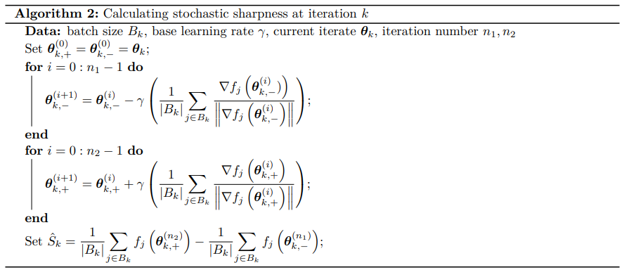

# SAM-SALR: Sharpness-aware Learning Rate Scheduler using SAM's sharpness

In the [SALR](https://arxiv.org/pdf/2011.05348.pdf) paper, the sharpness measure is used as the difference of loss value at the ascending step and descent step positions with the step size normalized by the norm gradient.

Instead I use the same sharpness measure as SAM

$$
\begin{align*}
    &\theta_{t+0.5} = \theta_t + \rho \frac{\nabla L(w)}{||\nabla L(w)||} \\
    &\text{sharpness} = L(\theta_{t+0.5}) - L(\theta_t)
\end{align*}
$$